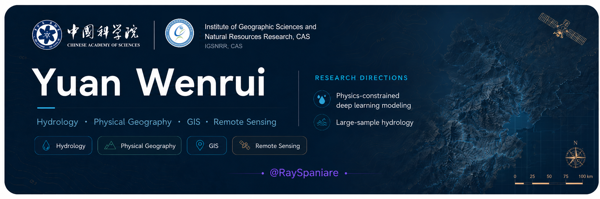
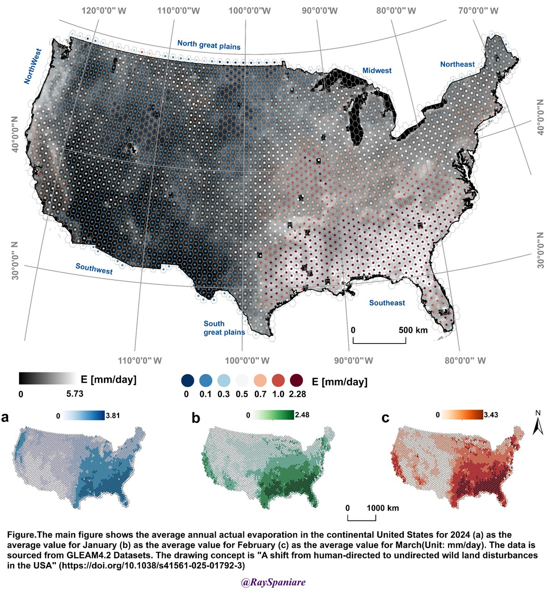
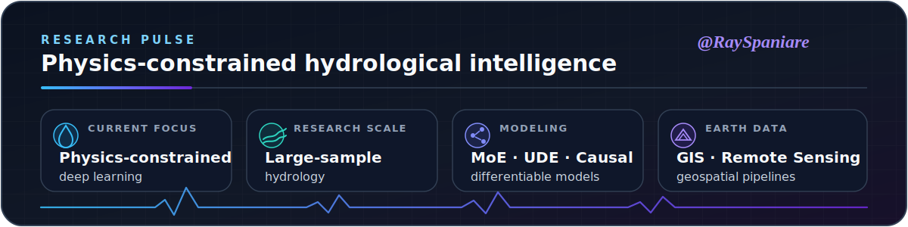

  

  <strong>Making hydrological AI physically meaningful, interpretable and reproducible.</strong>

  
  
  
  

## About

I am a graduate researcher at the **Institute of Geographic Sciences and Natural Resources Research, Chinese Academy of Sciences**.

My work combines **hydrological process knowledge**, **deep learning**, and **Earth observation data** to build models that are accurate, physically constrained, interpretable, and reproducible.

- Dynamic-gated and Mixture-of-Experts models for streamflow simulation
- Physics-aware deep learning for soil moisture and water-balance modeling
- Ecohydrological regulation diagnosis with causal and differentiable models
- GIS, remote sensing, and large-scale geospatial data processing

## Selected Publications

1. Yuan, W., Hu, S., Zhan, C. et al. A dynamic-gated Mixture-of-Experts framework improves and interprets daily streamflow simulation. *Commun Earth Environ* (2026). https://doi.org/10.1038/s43247-026-03799-z

2. Yuan, W., Hu, S., Zhan, C., Wang, G. & Luo, Y. Machine learning land surface temperature downscaling method based on Landsat 9 and Sentinel-2 satellite feature interaction. *Geo-Spatial Information Science* 1–22 (2025). https://doi.org/10.1080/10095020.2025.2598526

## Featured Visualization

  

 

## Research Map

<table>
<tr>
<td width="50%" valign="top">

### Hydrological AI

I develop neural hydrology models that combine data-driven prediction with process-level constraints, including routing behavior, water-balance structure, and interpretable expert selection.

</td>
<td width="50%" valign="top">

### Earth Observation

I use remote sensing, GIS, and geospatial pipelines to connect basin-scale hydrological signals with land surface dynamics, ecological regulation, and environmental change.

</td>
</tr>
<tr>
<td width="50%" valign="top">

### Interpretable Modeling

I care about why a model works: attribution, causal structure, uncertainty, and diagnostics that can be checked against hydrological knowledge.

</td>
<td width="50%" valign="top">

### Reproducible Research

I build analysis workflows around transparent data processing, audit-ready figures, documented experiments, and reusable code.

</td>
</tr>
</table>

## Selected Work

<table>
<tr>
<td width="50%" valign="top">

### HydroMoE

A dynamic-gated Mixture-of-Experts framework for improving and interpreting daily streamflow simulation.

</td>
<td width="50%" valign="top">

### Physics-Informed Hydrology

Physics-aware modeling for soil moisture, water-balance learning, and hydrological process diagnosis.

</td>
</tr>
</table>

## Research Stack

  
  
  
  
  
  
  
  

## Research Pulse

  

  

